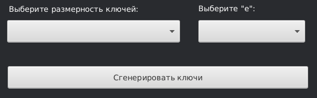

# Программа для шифрования с помощью алгоритма RSA.

# Особенности программы:

### 1. Наличие удобного интерфейса.
### 2. Наличие инструкции по применению.
### 3. Наличие функционала:
- Создание RSA ключей (открытого и закрытого).
- Шифрование и расшифрование текстовых файлов.
- Создание директорий для файлов, создающихся во время работы программы. 
- Вывод информации об ошибках.

# Документация по работе с программой:

### 1. Указание директории для хранения файлов программы.
В первую очередь необходимо указать папку для хранения файлов программы. Для этого найдите в интерфейсе
следующее поле ввода:

Выберите директорию нажав на кнопку, либо введите путь до файла в ручную.

### 2. Работа с ключами. 
Для шифрования и дешифрования вам необходимы ключи. Ключи вы можете сгенерировать, либо 
указать уже существующую пару.
- **Генерация новой пары ключей:**  
Для генерации новой пары найдите следующее поле ввода:

Выберите подходящий размер ключей, а также значение открытой экспоненты. Если при генерации вы получили 
предупреждение, то вам необходимо сменить открытую экспоненту и
повторить попытку. **По окночанию генерации, ваши ключи будут храниться в каталоге,
который вы указали на шаге 1.**

- **Использование существующей пары**  
Для указания существующих ключей найдите следующее поле:

Нажмите на кнопки выбора открытого и закрытого ключа, либо введите путь в ручную в поле ввода.
**Если ключи будут отличаться, программа при запуске шифрования или дешифрования выдаст ошибку!**

**При неуказанных ключах программа будет работать с самой последней сгенерированной парой!**

### 3. Шифрование и дешифрование.

**Перед шифрованием и дешифрованием проверьте наличие пути для сохранения файлов, а также связку ключей.**

- **Для шифрования** вы можете ввести текст в ручную, либо указать текстовый файл, который необходимо зашифровать.  

**Для указания пути до файла найдите следующее поле:**

Вы можете выбрать файл самостоятельно, нажав на кнопку, либо указать путь в ручную. После
этого нажмите на кнопку "Зашифровать". По окончании шифрования вы сможете увидеть ваш файл в папке, 
указанной в пункте 1.

**Для ввода текста найдите следующее поле:**

После ввода текста нажмите на кнопку "Зашифровать".

**Если в поле ввода текста и пути до файла будут введенные данные, приоритет будет у строки для 
ввода файла!**

_________

- **Для дешифрования** найдите следующее поле ввода:

Файл для дешифрования вы можете выбрать, нажав на кнопку, либо ввести путь в ручную.
По окончании дешифрования вы увидите созданный файл в папке, которую вы указали в пункте 1.

### 4. Вызов подсказки.
В правом верхнем углу окна находится кнопка с вопросительным знаком, по нажатию на которую появляется 
окно с подсказкой. В данном окне детально описанны шаги для работы с программой.

